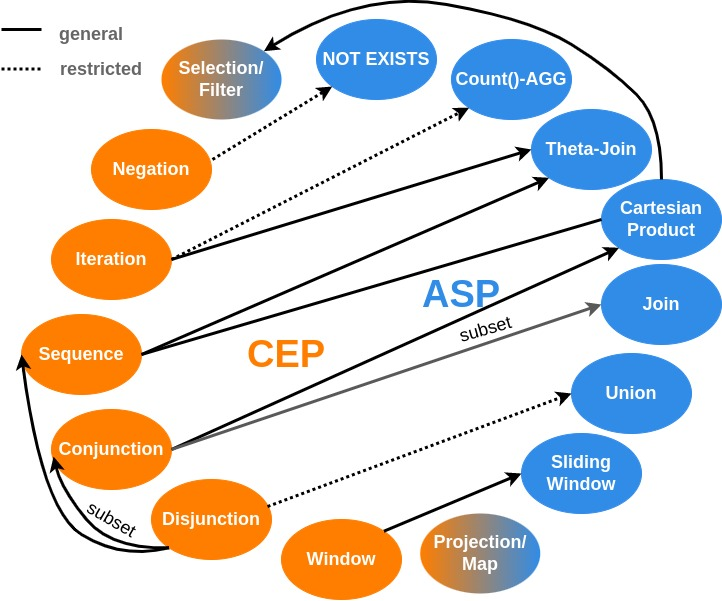

# Bridging the Gap: Complex Event Processing on Stream Processing Engines

This repository provides a query catalog of Complex Event Processing (CEP) patterns, and their respective Analytical Stream Processing (ASP) queries, translated using our theoretical operator mapping approach. 
The provided queries are written using Apache Flinks Streaming API and its CEP library. 

**Warning** 
We are currently observing the problem that data links are not consistently updated in the anonymous repository, the link is: https://gofile.io/d/pjglkV. 

## Repository Structure
- **scripts_configs**: This folder contains a script for each experiment, a flink-conf.yaml with our settings, and a README.md with details about our evaluation, e.g., how we define maximal maintainable throughput, or a summary table that indicates with pattern was used in which experiment. 
- **Source Root**: Each class in the source folder presents a single pattern or query, which can be run using the provided parameters on top of the class. For each pattern, we provide a translated ASP query, e.g., Q1_SEQQuery is the translation of Q1_SEQPattern. All queries and patterns are listed in the PatternQueryCatalog.md. 
- **Resource Root**: Contains small samples of the original data for testing. The attached README describes the data further and provides the link to the data samples used for our experiments. 
- Finally, we added a first draft of our formal proof for the correctness of our mapping (see **FormalProofOfInterWindowSemantics.pdf**)
## Mapping 



## Next Steps

We are currently investigating a solution to automatically transform patterns written in a declarative pattern specification language (PSL) into ASP queries.
To this end, we are creating a parser (using ANTLR [3]) for a PSL based on SASE+ [1,2]. Given a pattern, ANLTR creates an AST, which we then can walk to directly create the logical operator tree of the corresponding ASP query.
Herewith, we enable users to leverage our mapping but hide the complexity of our mapping and optimization decisions, such as selecting join types.
Further steps include the creation of connectors to common ASP engines, e.g., Apache Flink, Spark, and Beam.
Yet, the mapping needs to be applied manually.

## Mapping Directives: How to apply the mapping to your pattern - An Example

We use the structure of the SQL-based language SASE+ [1,2] to specify example patterns. 
The SASE+ language uses the following general structure:

``` 
PATTERN < pattern structure >
[ WHERE < pattern matching condition >]
[ WITHIN < sliding window >]
[ RETURN < output specification >]
```

The **PATTERN** clause contains the operators and streams the pattern it is applied to. 
1. Each stream of the **PATTERN** clause is added to the **FROM** clause of the query (separated by `,` to form the Cartesian Product as default). 
2. The **WHERE** clauses of both requests are identical for simple threshold filters and inter-event constraints.
2. For each SEQ-pair, i.e., SEQ(A,B), create a predicate for increasing timestamp and combine predicates using a logical AND. Do the same for each event m of the iteration operator.

   **Note:** The sequence operator is associative and SEQ(A,B,C) is short for SEQ(SEQ(A,B),C)/SEQ(A,SEQ(B,C)). 
   
   For a negated event type (negation operator), add a negated EXISTS operator with the following sub-query in the **WHERE** clause and remove the negated event type from the **FROM** clause.
   ``` sql
   NOT EXISTS (SELECT *
               FROM Stream T2
              [WHERE <SEQ Time-Constraints>])
    ``` 
   **Note:** The **WHERE** clause of the sub-query is only required if the negation operator is nested in a sequence and depends on its position.
2. Identify join predicates in the WHERE clause, and for each identified join predicate, transform the Cartesian Product in the **FROM** clause (e.g., FROM stream a, stream b) into a join (e.g., FROM stream a JOIN stream b ON key_a = key_b). For performance benefits in a distributed system, prefer Equi joins over Theta Joins. 
3. The **WITHIN** clause contains the window constraint W of the pattern. In the query, the window constraint W defines the Range of the **WINDOW** clause (the window size).  
4. Finally, the **SELECT** clause defines the output specification of the query is defined
with ∗. 

   **Note:** The output tuple can also be modified in the pattern by adding the **RETURN** clause.

## References 
[1] D. Gyllstrom, J. Agrawal, et al. On supporting kleene closure over event streams. In ICDE 2008, April, 2008. IEEE Computer Society, 2008

[2] http://sase.cs.umass.edu//index.php?page=language

[3] https://www.antlr.org/
